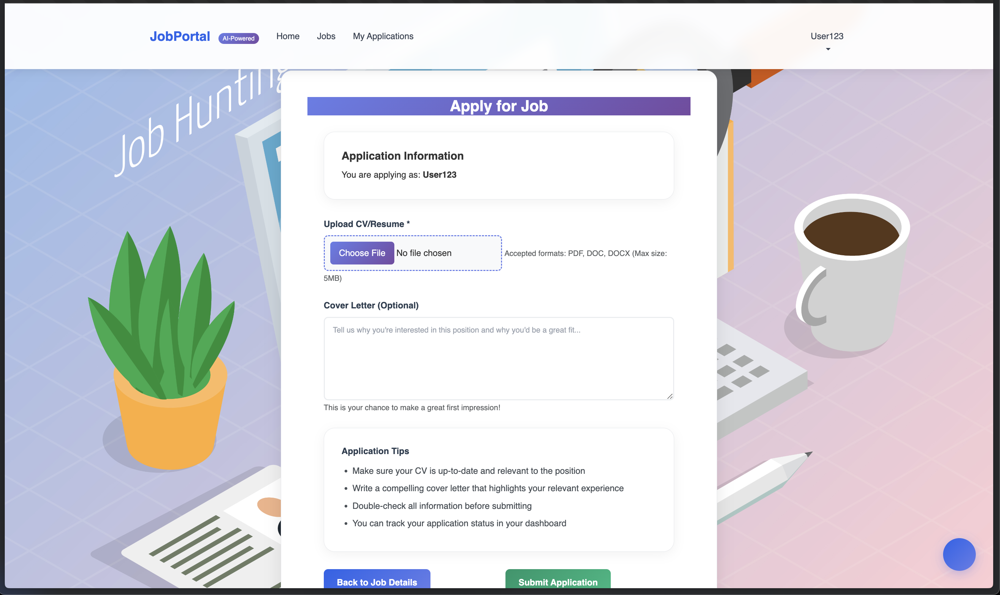
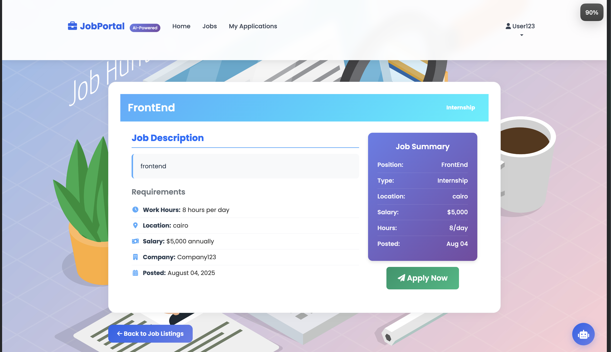
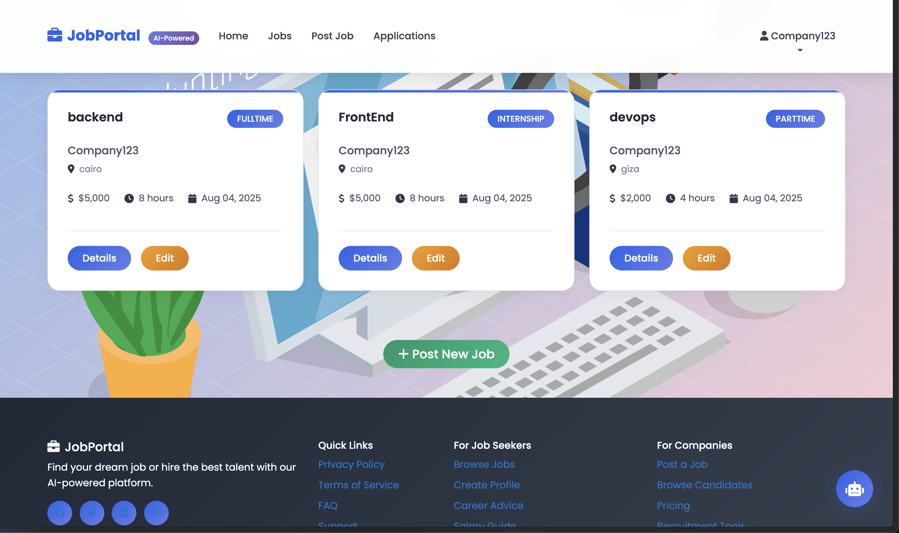
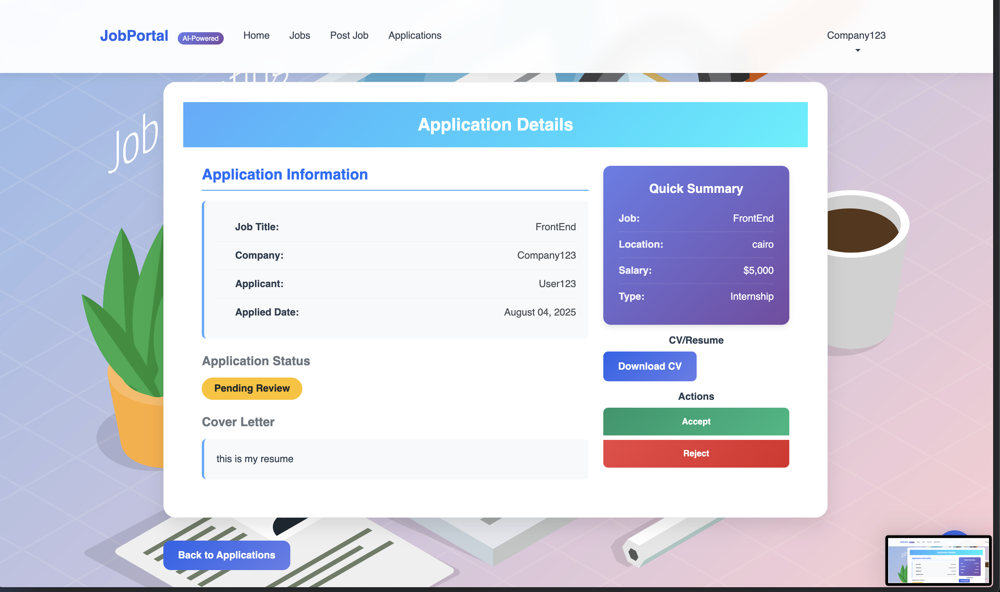
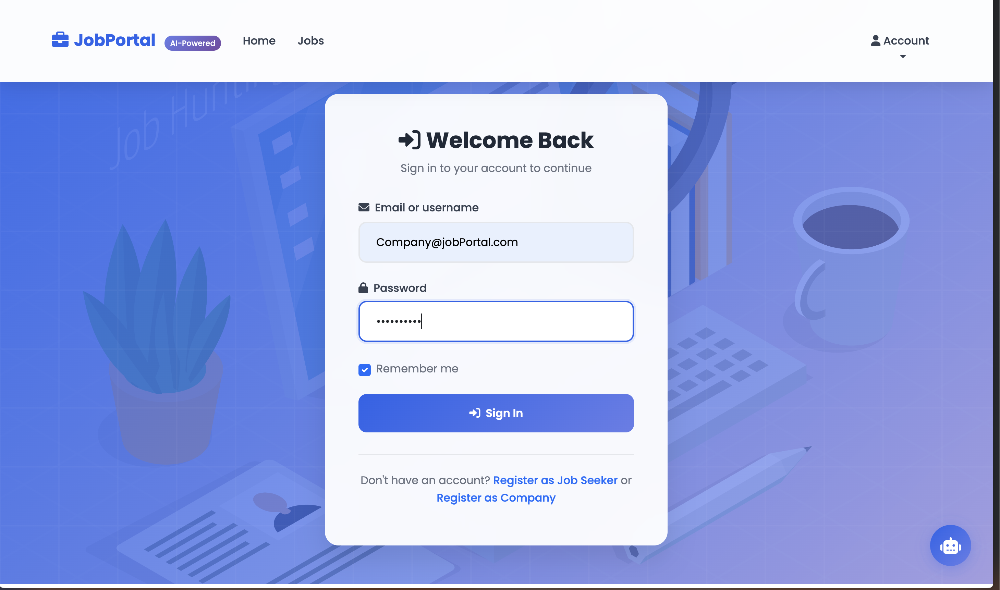

# 💼 JobPortal

An ASP.NET Core MVC web application for job seekers and employers to connect. Users can register as either a company or a job seeker, post jobs, apply for jobs, and manage their profile.

---

## 🚀 Features

### 👥 Authentication & Authorization
- Register/Login as **User** or **Company**
- Role-based access (User vs Company vs Admin)
- Email or Username login
- "Remember Me" session management

### 📝 Job Management
- Companies can post, edit, and delete jobs
- Users can view and apply to available jobs
- Job filtering/searching functionality

### 📄 Applications
- Users can view their applications
- Companies can see applicants for posted jobs

### 📬 Notifications
- In-app feedback on user actions
- Success/failure messages

---

## 🧰 Tech Stack

| Layer        | Technology                       |
|--------------|----------------------------------|
| Backend      | ASP.NET Core MVC                 |
| Frontend     | Razor Views, Bootstrap           |
| ORM          | Entity Framework Core            |
| Auth         | ASP.NET Identity                 |
| Database     | SQLite / SQL Server              |
| Styling      | CSS, Bootstrap 5                 |

---

## 📸 Screenshots

### 📝 Apply Job


### 🔍 Job Details


### 📋 Jobs Listing


### 🧾 Review Application


### 🔐 Sign In



---

## 🛠️ Setup Instructions

### 1. Clone the repository

```bash
git clone https://github.com/mario985/JobPortal.git
cd JobPortal
```

### 2. Setup the database

#### Using SQLite (default)

```bash
dotnet ef database update
```

#### OR using SQL Server

Update the connection string in `appsettings.json`:

```json
"ConnectionStrings": {
  "DefaultConnection": "Server=YOUR_SERVER;Database=JobPortalDB;Trusted_Connection=True;"
}
```

Then:

```bash
dotnet ef database update
```

### 3. Run the application

```bash
dotnet run
```

---

## ✅ Admin Account
Email: Company123@jobportal.com
Password: Company123
## user  Account
Email :User@jobportal.com
Password : User1234
---

## 📂 Folder Structure

```
JobPortal/
│
├── Controllers/
├── Models/
├── Views/
├── Data/
├── wwwroot/
├── appsettings.json
└── Program.cs

---

## 📧 Contact

Feel free to reach out if you have suggestions, feature requests, or just want to connect!

- GitHub: [@mario985](https://github.com/mario985)
- Email: mariodawod12@gmail.com